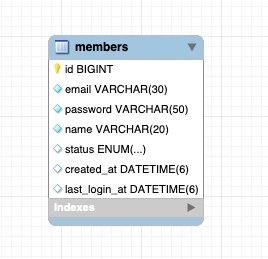
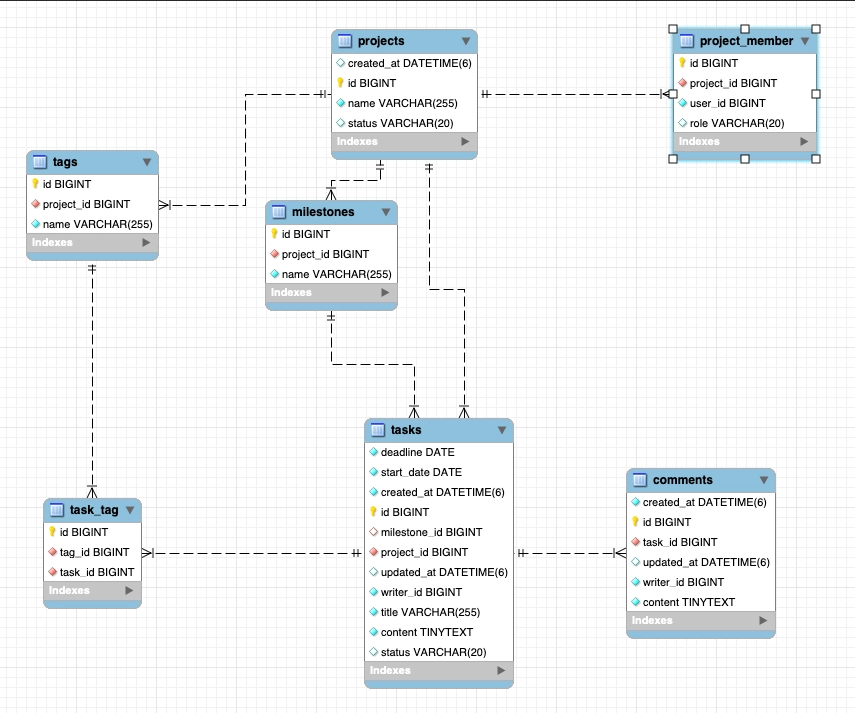
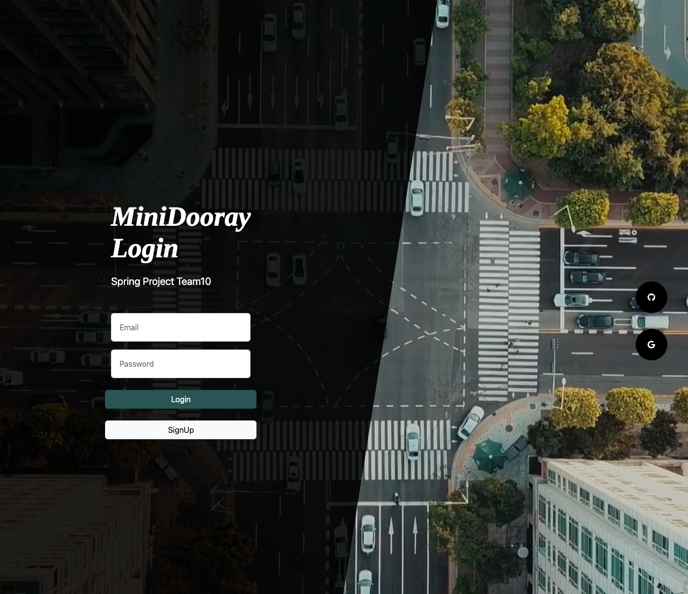
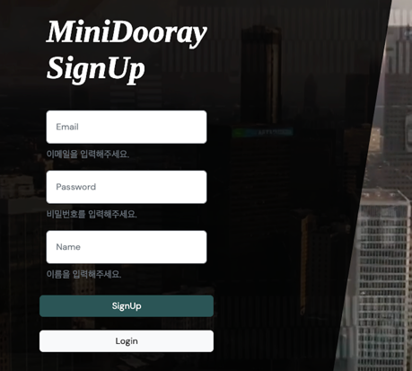
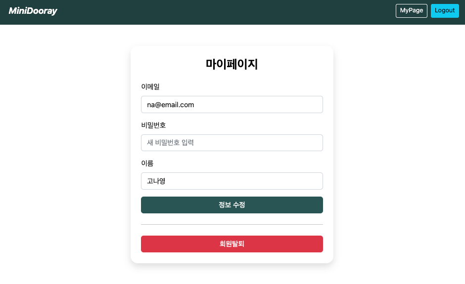
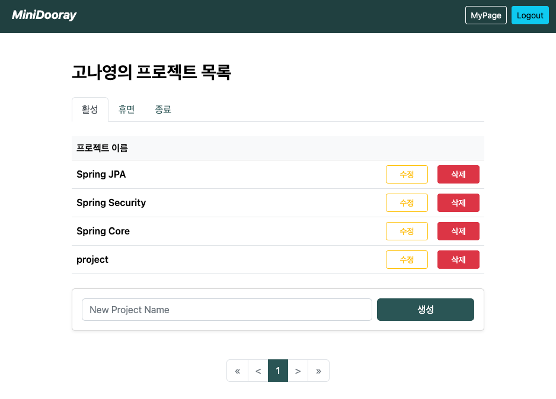
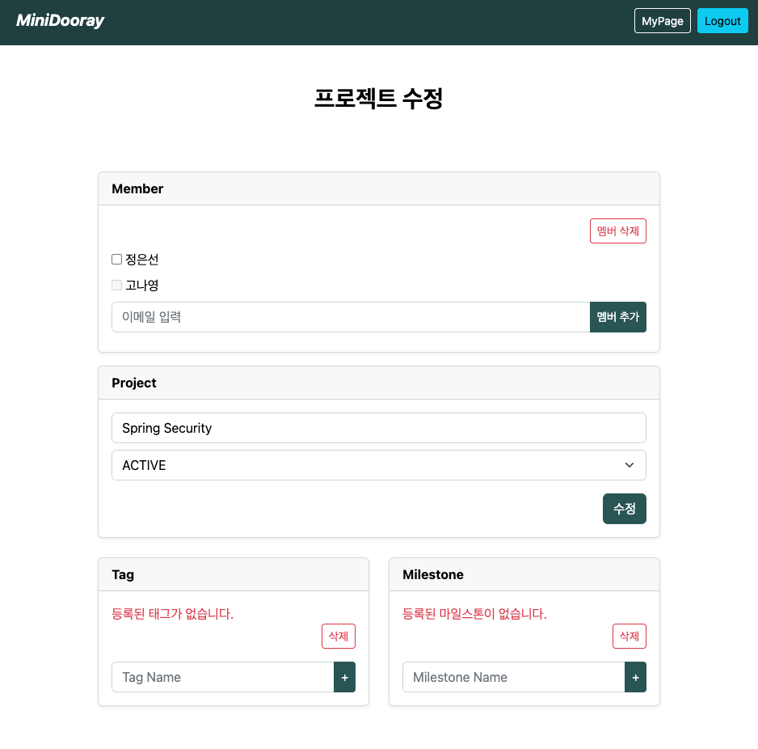
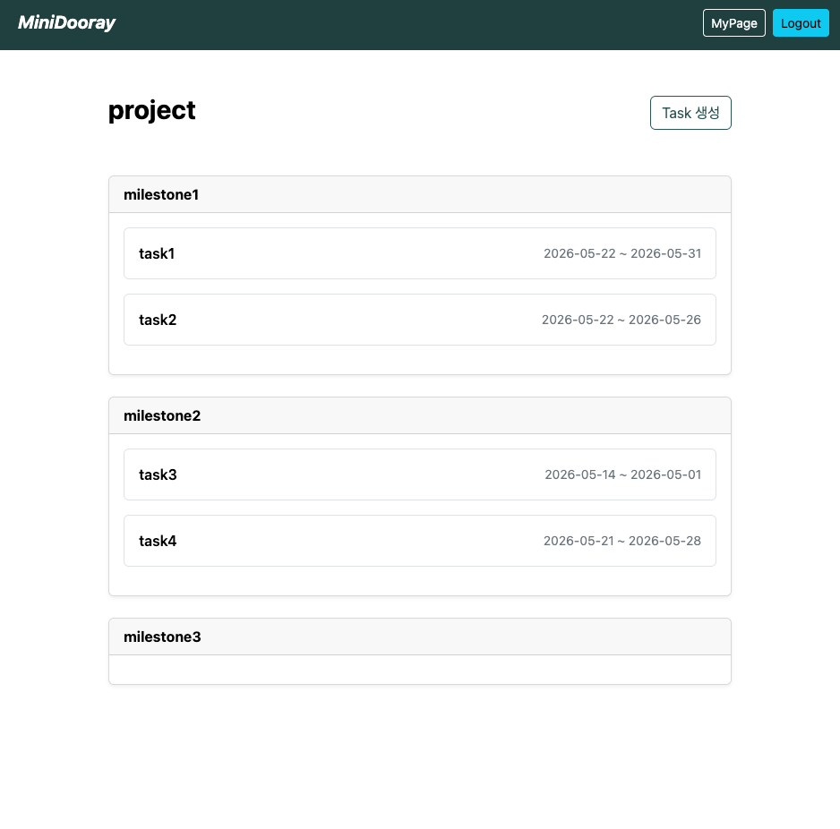
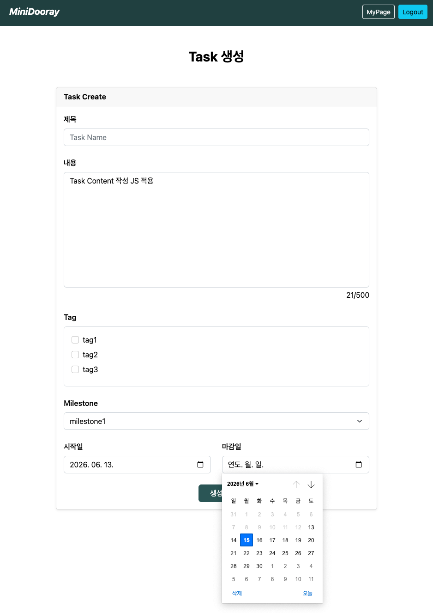
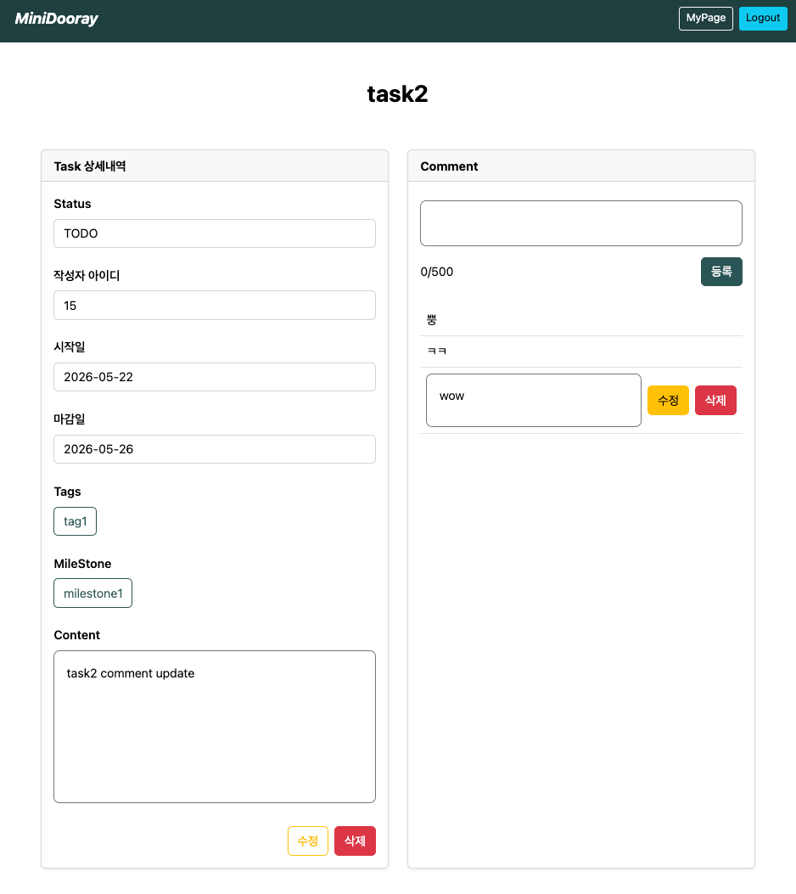

# Mini Dooray
> Spring Boot 기반의 협업 프로젝트 관리 서비스
---
## 🧑‍💻 프로젝트 소개
#### 개발 기간 : 2026.05.14 - 2026.05.22 (9일)
- 프로젝트, 업무, 댓글, 태그, 마일스톤 관리 기능을 제공하는 협업 서비스입니다. 
- Spring Boot 기반으로 개발하였으며, Spring Security를 활용한 인증 처리와 API 기반 서비스 분리 구조를 적용한 **4인 팀 프로젝트**입니다.

### 주요 기능
- 프로젝트 관리 : 프로젝트 생성, 수정, 삭제 및 참여 멤버 관리
- 업무(Task) 관리 : 업무 등록, 상태 변경, 일정 및 담당 업무 관리
- 댓글(Comment) : 업무별 의견 공유 및 협업 지원
- 태그(Tag) 관리 : 업무 분류
- 마일스톤(Milestone) : 프로젝트 일정 및 진행 단계 관리
- 인증(Authentication) : Spring Security와 Redis Session 기반 로그인 관리

### 핵심 경험
- Redis Session Clustering 기반 인증 세션 관리
- Spring Cloud Gateway 기반 서비스 라우팅
- 공통 Exception & Error Code 체계 구축
- Validation Group을 활용한 입력 검증 전략 적용

---

## 🛠️ Tech Stack
### Develop
<div>
  
  
  
  
  
  
</div>

### Testing & Quality
<div>
  
  
  
  
</div>

---

## 🔗 Repository
| Service | Description                           | Repository |
|--|---------------------------------------|---|
| Front | 사용자 UI 및 화면 렌더링 (Thymeleaf 기반), 인증 처리 | [](https://github.com/AIoT-3/minidooray-team10-front.git)|
| Gateway | 요청 라우팅                                | [](https://github.com/AIoT-3/minidooray-team10-gateway.git)|
| Task | 프로젝트 핵심 비즈니스 로직                       | [](https://github.com/AIoT-3/minidooray-team10-account-api.git)|
| Account | 회원 핵심 비즈니스 로직                         | [](https://github.com/AIoT-3/minidooray-team10-task-api.git)|

---

## 💻 시스템 구조
> 본 프로젝트는 기능별 서비스 분리를 적용하여 개발하였습니다.
### Architecture
```text
Client
   │
   ▼
Front Server
   │
   ▼
Gateway Server 
   │
   ├── Account API
   └── Task API
```

### Service Description
#### Front 
- 사용자 요청 수신
- 인증 및 로그인 처리
- View 렌더링
- Gateway 연동
#### Gateway
- 요청 라우팅
- Account API / Task API 연결
#### Account API
- 회원 관리
- 인증 관련 기능 제공
#### Task API
- 프로젝트 ,업무, 댓글, 태그, 마일스톤 관련 기능 제공

### ERD (Entity-Relationship-Diagram)
| account.api | task.api                                              |
|-------------|-------------------------------------------------------|
|  |  |

### 목업


---

## 🙆🏻‍♀️ 담당 역할
### Front + Gateway 서버 개발
> 사용자 요청 처리와 화면 렌더링을 담당하는 Front 서버를 개발하였습니다.

#### 주요 업무
* Spring Security 기반 인증 기능 구현 
* Redis Session Clustering 적용 
* Thymeleaf 기반 화면 렌더링 구현 
* Account API / Task API 연동 
* Validation 및 예외 처리 구현

### API Gateway 연동
- 모든 사용자 요청은 Front 서버를 통해 처리되며, 데이터 조회 및 저장이 필요한 경우 Gateway 서버(8000)로 요청을 전달합니다.
- Gateway는 요청 경로에 따라 Account API와 Task API로 라우팅하며, Front 서버는 응답 데이터를 가공하여 사용자 화면에 렌더링합니다.

```text
Client
   │
   ▼
Front Server (8080)
   │
   ▼
Gateway Server (8000)
   │
   ├── Account API (8081)
   └── Task API (8082)
   │
   ▼
View Rendering
```

### 인증 및 세션 관리
- Spring Security와 Redis를 활용하여 인증 기능을 구현하였습니다.
#### Redis Session Clustering
- 여러 서버가 동일한 Redis 세션 저장소를 사용하도록 구성하여 세션을 중앙 집중식으로 관리하였습니다.

#### Redis를 선택한 이유
* In-Memory 기반의 빠른 조회 성능
* 빈번한 세션 접근 처리에 적합
* 서버 간 세션 공유 가능
* 향후 확장 환경에 대응 가능

### 사용자 정보 전달 자동화
- Gateway에서 내부 API를 호출할 때 로그인 사용자 정보를 전달하기 위해 `UserIdHeaderInterceptor`를 적용하였습니다.

#### 구현 내용
* 모든 RestTemplate 요청에 `X-USER-ID` 헤더 자동 추가
* 인증 사용자 정보의 일관된 전달 보장
* 중복 코드 제거 및 유지보수성 향상

---

## 🚀주요 설계 및 문제 해결
### 1. 공통 예외 처리 체계 구축
- 서비스별로 서로 다른 예외 응답 형식을 사용하는 문제를 해결하기 위해 공통 예외 처리 전략을 사용하였습니다.
#### 적용 내용
- 상위 Custom Exception 정의
- Error Code 표준화
- Global Exception Handler 적용
- 일관된 Error Response 구조 제공
#### 예시
|HTTP Status|Code|Description|
|---|---|-----|
404|	P003|	Project Not Found|
404	|K005	|Task Not Found|
404|	C001|	Comment Not Found|
409	|P012	|Project Already Exists|
403|	N021|	Unauthorized Access|
500	|S500	|Internal Server Error|
#### 결과
- 클라이언트가 예외 상황을 일관되게 처리 가능
- 서비스 간 오류 응답 규격 통일
- 유지보수성 향상

### 2. Validation 전략 수립
- 프론트엔드와 서버 양쪽에서 검증을 수행하였습니다.
#### 적용 내용
- Bean Validation
- Validation Group
- Thymeleaf Validation Error 처리
- DTO 기반 입력 검증
#### 결과
- 잘못된 사용자 입력 사전 방지
- 입력 데이터 무결성 보장
- 일관된 검증 정책 적용

---

## 📷 결과물
- Account

| login                                              | signup(validation)                                  | MyPage                                              |
|----------------------------------------------------|-----------------------------------------------------|-----------------------------------------------------|
|  |  |  |

- Task

| Main (Project List)                                    | Project Create                                           | Project Modify                                              |
|--------------------------------------------------------|----------------------------------------------------------|-------------------------------------------------------------|
|       | Main에서 이름으로 생성                                           |  |
| Task List                                              | Task Create                                              | Task Detail                                                 |
|  |  |     |

---

## 🌱 회고 및 개선 예정 사항
### 💬 회고
- 팀 프로젝트 특성상 기능 구현에 집중하면서 Validation을 간소화하는 경우가 많았지만, 입력값 검증 또한 서비스 품질의 중요한 요소라고 판단하여 프론트엔드와 서버 양쪽에서 검증을 수행하였습니다. 
- Validation Group, Bean Validation, Thymeleaf Error 처리를 적용하며 사용자 입력 오류를 체계적으로 관리하는 방법을 경험할 수 있었습니다. 
- 코드 리뷰 과정에서 @Valid와 BindingResult를 과도하게 사용한 부분을 발견하였고, JavaScript 검증과 서버 검증의 역할을 분리하는 방향으로 개선할 필요성을 학습하였습니다. 
- Front, Gateway, Account API, Task API로 서비스를 분리하여 API 기반 통신 구조와 역할 분리의 중요성을 경험할 수 있었습니다.
### 리팩토링 예정
- Spring Cloud Netflix Eureka 기반 Service Discovery 적용 
- Front Server 책임 분리 
- Validation 로직 일부를 JavaScript 기반 검증으로 이전 
- SonarQube로 측정된 Issue 개선
